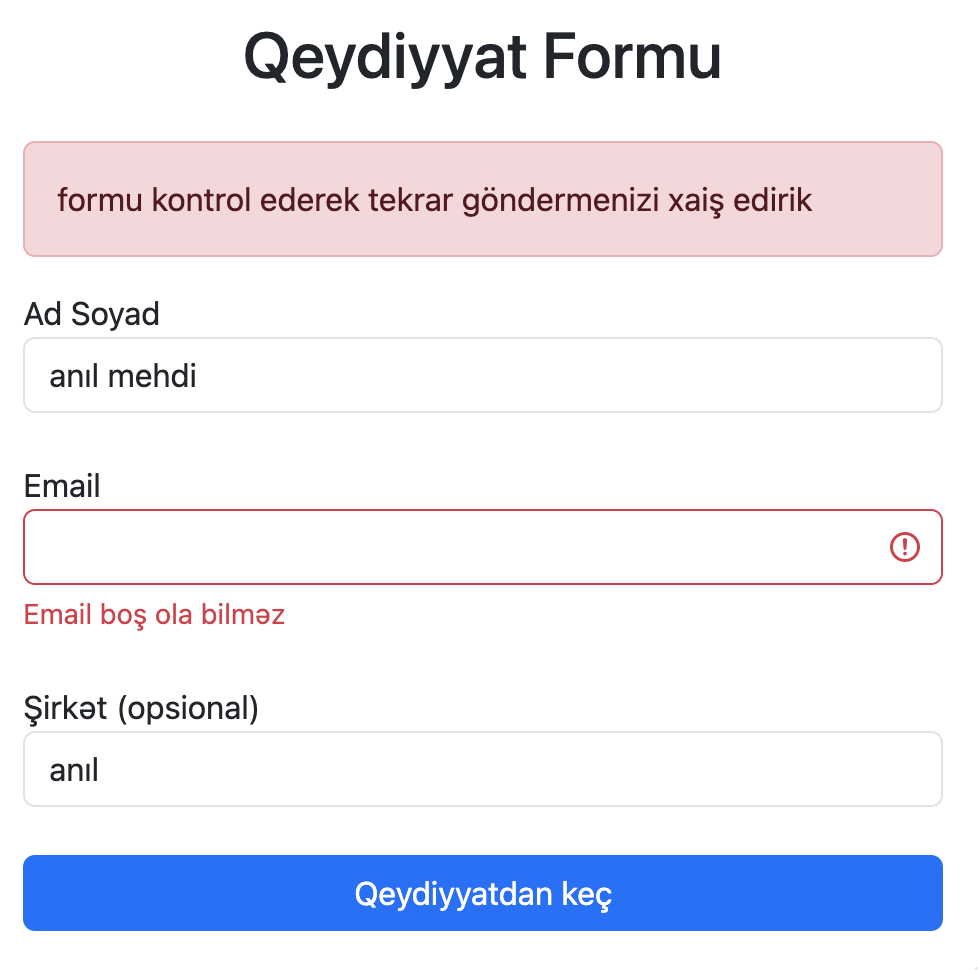
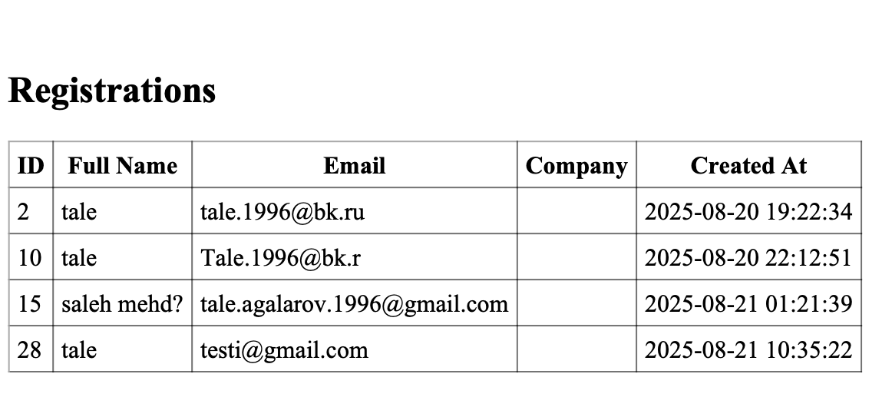
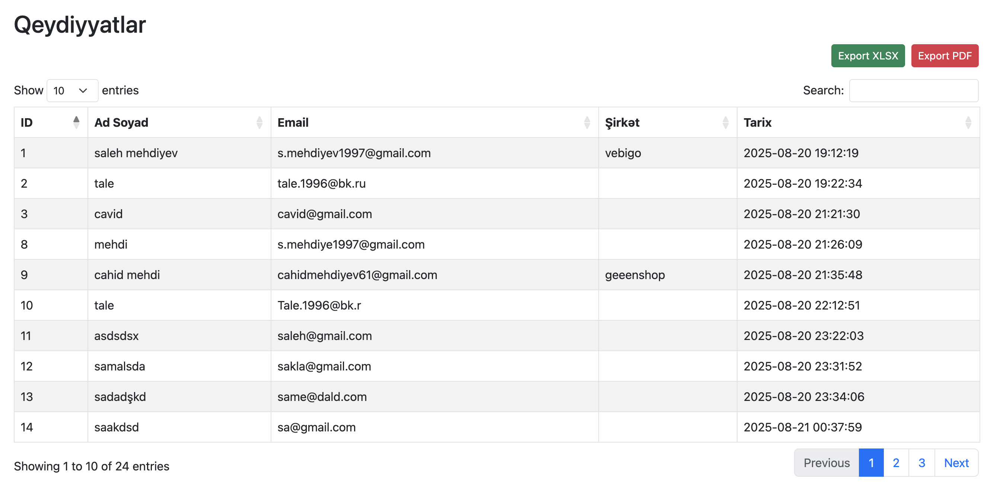
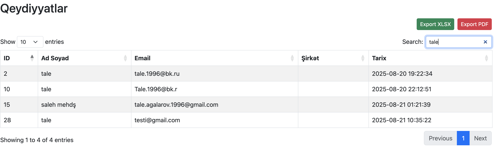

# PHP Form + DataTable Projesi

Bu layihə sadə bir **form əlavə etmə**, **backend validation** və **DataTable** ilə listeleme funksionallığını təqdim edir.  
AJAX vasitəsilə sorğular göndərilir və nəticələr ekrana basılır.

---

## Quraşdırma

1. **Tələb olunan PHP versiyası:** `>=8.0`  
2. **Composer** quraşdırılmalıdır və layihədə `composer install` çalışdırılmalıdır.  
3. `.env` faylında **DB bağlantısı** parametrlərini dəyişin:

DB_HOST=localhost
DB_PORT=3306
DB_NAME=your_database
DB_USER=root
DB_PASS=yourpassword
DB_CHARSET=utf8mb4


4. Email göndərilməsi üçün **SMTP parametrlərini** `.env` faylında verin:

SMTP_HOST=smtp-host
SMTP_PORT=587
SMTP_USER=yourmail@gmail.com
SMTP_PASS=yourpassword
SMTP_FROM=youremail@gmail.com
SMTP_FROM_NAME=Mini App


5. Admin panel girişi üçün **email və şifrəni** `.env` faylında əlavə edin:(bu bilgiler normalda table'den ve pass hash'lenmiş şekilde tutulmalıdı. )

ADMIN_EMAIL=admin@example.com
ADMIN_PASS=123456
---

## Database

Aşağıdakı SQL ilə cədvəl yaradın:

```sql
CREATE TABLE users (
    id INT AUTO_INCREMENT PRIMARY KEY,
    full_name VARCHAR(120) NOT NULL,
    email VARCHAR(150) NOT NULL,
    company VARCHAR(120) DEFAULT NULL,
    created_at TIMESTAMP DEFAULT CURRENT_TIMESTAMP
);

İşlətmə:

Form (yeni qeydiyyat əlavə etmək):
http://localhost/index.php

Qeydiyyat listesini görmək:
http://localhost/list.php

Form AJAX validation:


DataTable və export düymələri:



